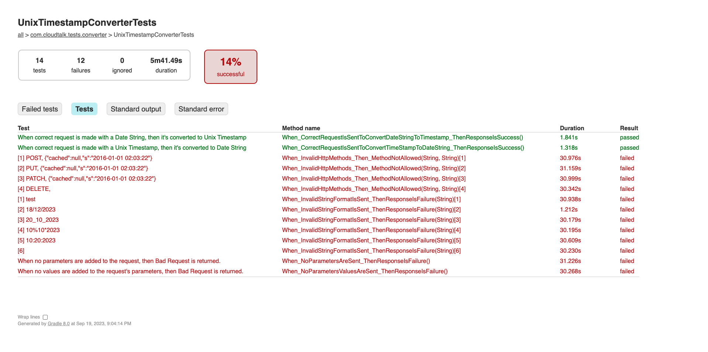
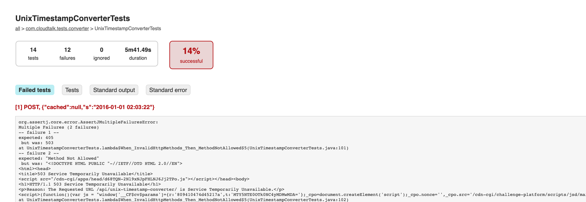

# CloudTalk testing task - David García Martín

This test suite is designed to automate the following API (Unix Timestamp Converter):
https://helloacm.com/tools/unix-timestamp-converter/

This project is using the following technologies and libraries:

* **Gradle**: Open-source automation tool that is used for building, testing, and deploying this Java 17 project.
* **Lombok**: This library is used to simplify the development of this application. Specifically this project is using
  the following:
    * @Slf4j - for adding logs into the tests.
    * @Builder - annotation used for constructing objects and provide default values.
    * @Data - annotation used for generating getters and setters for all fields in the class.
    * @NoArgsConstructor - annotation used for generating no-argument constructor.
    * @NoArgsCon@AllArgsConstructor - annotation used for generating a constructor that initializes all fields in the
      class.
* **Jackson**: This library is used for working with JSON data (used in this project as an example). ObjectMapper is
  used to write the payload of some requests.
* **CI/CD integration**: A Jenkinsfile is provided as an example on how to integrate with Jenkins.
* **OkHttp3**: Open-source library used for the HTTP client.
* **JUnit, Assertj-SoftAssertions**: Java libraries used for testing. SoftAssertions are used to continue running all
  assertions in a test case even if one of them fails, so multiple issues can be identified in one go.
* **awaitility**: Library used to improve test stability since sometimes the API is returning a 503 code, by using this
  library a wait condition is put in place by checking that the returned code != 503 with a timeout.

## Code Structure

* gradle:
    * ***dependencies.gradle*** includes all the dependencies needed for the project, variables are used to set the
      versions in a specific file (gradle.properties) for better code maintainability.
* tool:
    * ***converter > ConverterHelpers*** this is a helper class for the tests where all the logic for making the
      requests and the parameterized provider methods are located. This file can be reused if other APIs are needed to
      be tested.
    * ***model>ConverterRequest*** DTO and POJO class that can be used to communicate between the front-end and the
      back-end. A JSON payload can be generated for other requests by using Jackson(ObjectMapper) library.
    * ***util>ConverterConstants*** includes all the constants for the tests. For example, the target URL (BASE_URL) or
      the timeout for waiting for a response different from 503.
    * ***util>HttpClient*** this utility class is used for making HTTP request using the OkHttp client, it encapsulates
      common HTTP requests.
* ***UnixTimestampConverterTests*** includes all the test scenarios. The test cases have been configured in order to
  comply with the HTTP standards, since this API is not following the best practices, I decided to let some cases fail
  expecting the correct values:
    * When_CorrectRequestIsSentToConvertDateStringToTimestamp_ThenResponseIsSuccess - Success test case in which the
      expected String date is provided to convert it into Timestamp format.
    * When_CorrectRequestIsSentToConvertTimeStampToDateString_ThenResponseIsSuccess - Success test case in which the
      expected Timestamp is provided to convert it into String date format.
    * When_NoParametersValuesAreSent_ThenResponseIsFailure - the API is returning a 200 and "false" but this is not the
      best practice. That's why I make this test fail, it should for example, return a "400 - Bad Request" error since "
      s" is having an invalid value.
    * When_NoParametersAreSent_ThenResponseIsFailure - A "400 - Bad Request" error should be returned since no
      parameters are provided to the request. The API is returning a 200 and "false" but this is not the best practice.
      That's why I make this test fail, it should for example, return a "400 - Bad Request" error since "s" is having an
      invalid value.
    * When_InvalidStringFormatIsSent_ThenResponseIsFailure - Parameterized test that sends different invalid strings
      to "s" parameter.
    * When_InvalidHttpMethods_Then_MethodNotAllowed - According to the best practices, the only allowed method should
      be "GET" since we are retrieving data from the server without modifying it's state. For any other methods, a "
      405 - Method Not Allowed" should be returned. The API is currently accepting all methods.
* ***gradle.properties*** configuration file is used to manage the version of the dependencies of the project.
* ***Jenkinsfile*** Groovy format file that includes an example in order to include these tests in a CI/CD pipeline:

  The logic includes the ability to set the pipeline to either "Success", "Failure" or "Unstable" depending on the
  needs.
  For example, the build can be set to "Unstable" in case of working on a development branch test execution in which the
  developers are working and if the next step in Jenkins is deploying in the environment. This way, the pipeline is not
  blocked and the deployment can be succeeded.
  On the other hand, in Pull requests or master branches it could be a good idea to make the build fail and not to
  continue if the tests are failing.

## Running the tests and requirements

Make sure to have Gradle and a Java SDK installed (https://gradle.org/install/):

For macOS devices:

```
 brew install gradle
```

Download the code to the desired location and keep track of the location, so that the project can be easily accessed to
execute the tests.

Execute the following commands inside the root folder of the repository in your local machine:

* Clean-up any previously generated build artifacts and temporary files if needed:
    ```
    ./gradlew clean build
    ```
* Run the tests:
    ```
    ./gradlew test
    ```

Results can be checked in the terminal and also in the HTML report generated by Gradle. To check the results go to the
root of the project and then go to build > reports > tests > test and open the index.html file in your browser.

For example:

Test report in HTML format: [View Test Results](demo/test/index.html)

Test summary screenshot from the report:

Test detail screenshot from the report:


## API improvements and next steps

### API improvements

I have found the following improvements that can be made for this API:

* ***Return a "405-Method Not Allowed" error:*** The API is allowing all HTTP Methods (POST, PUT, GET, PATCH, DELETE,
  etc.).
  However, the purpose of this API is to retrieve a timestamp/dateString based on the date provided in the "s" query
  parameter.
  Since the API is not causing any modifications to the server's state, the only HTTP method that should be allowed
  should be "GET".
  The rest of the HTTP methods should be returning a "405 - Method Not Allowed" error.
* ***Return a "400-Bad Request" error:*** The API is returning a 200 success code and "false" when invalid parameters or
  missing parameters are provided to the request. According to the best practices, a "400 - Bad Request" should be
  returned for example. It would be also a good idea to return a 500 Internal Server Error with a custom message. In any
  case, custom messages could be a good approach to let the customers know that an error occurred and which was the
  cause of the error.
* ***Improve API stability*** a lot of times the API is returning a "503 Service Unavailable". In order to avoid this
  the rate limiting could be increased to allow more requests. In addition, it seems like no monitoring is made so this
  could be a good improvement along with a status page that shows how healthy the API is in a specific moment.
* ***API documentation***: it complicated to know how the API behaves, authentication method allowed for the requests,
  the parameters that are mandatory, the type of
  the parameter (string, integer, etc), expected responses, etc. Tools like Swagger/OpenAPI could be used to have a
  proper documentation and providing a way to explore them.

### Next steps

I have identified the following testing improvements that can be done to properly have an API testing framework:

#### Component tests (Docker images)

Component tests using Docker are a very good idea to test an API service. They allow to test the entire API service and
dependencies, maintaining isolation by using Docker containers. They can also be integrated in the CI/CD pipeline and
allows fast detection of errors.

They could be added by generating a "docker-compose.yml" file to the project that includes the necessary services for
the tests. After that, by just executing "docker-compose up" in a terminal from the root of the project, the necessary
containers for testing the application will be executed along with the tests.

#### Contract tests (PACT framework)

PACT framework can be used to implement Contract tests.
These tests verify that the interactions between consumers and providers follow the defined contract (avoid breaking
changes, ensure compatibility after changes, etc.). They can also be integrated in the CI/CD pipeline.
In the case of HTTP APIs, the provider is the service that provides the API or web service. The consumer is the service
that makes requests to the provider's API.

#### Performance tests (Locust framework)

Performance test can be also implemented in order to keep track of the performance of the API.
Locust framework and Python can be used to achieve this, it relies on users and tasks that perform different requests to
the APIs. It can be run in Docker containers too and be included in the CI/CD pipeline to ensure that newest changes are
not degrading the performance of the API.

#### API  security testing

Have some security verification like SQL Injection, input validation (dangerous characters in the parameters, only allow
specific formats, etc).